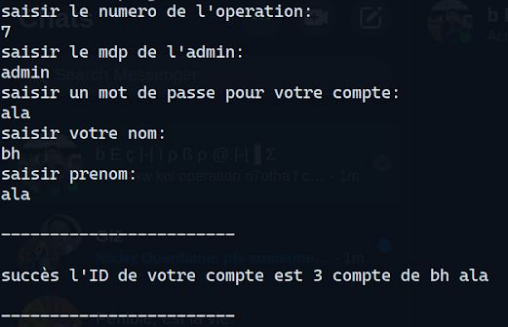
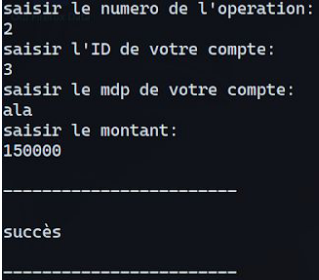
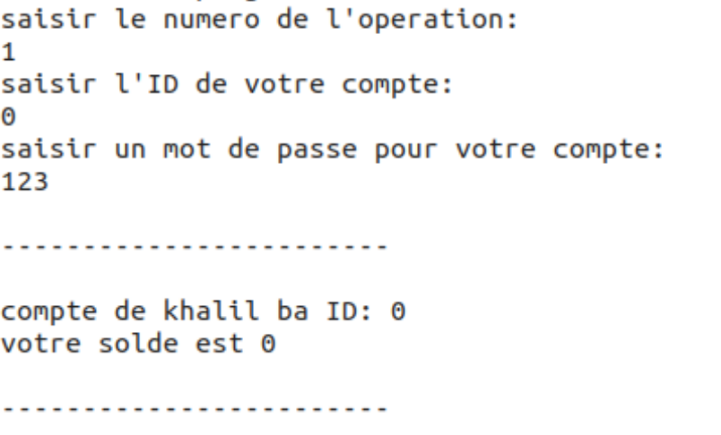
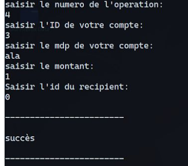
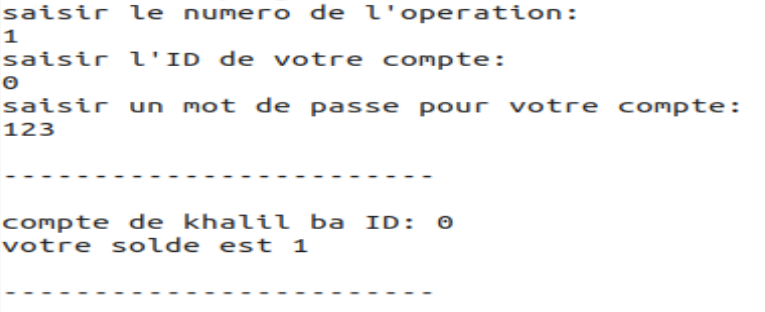
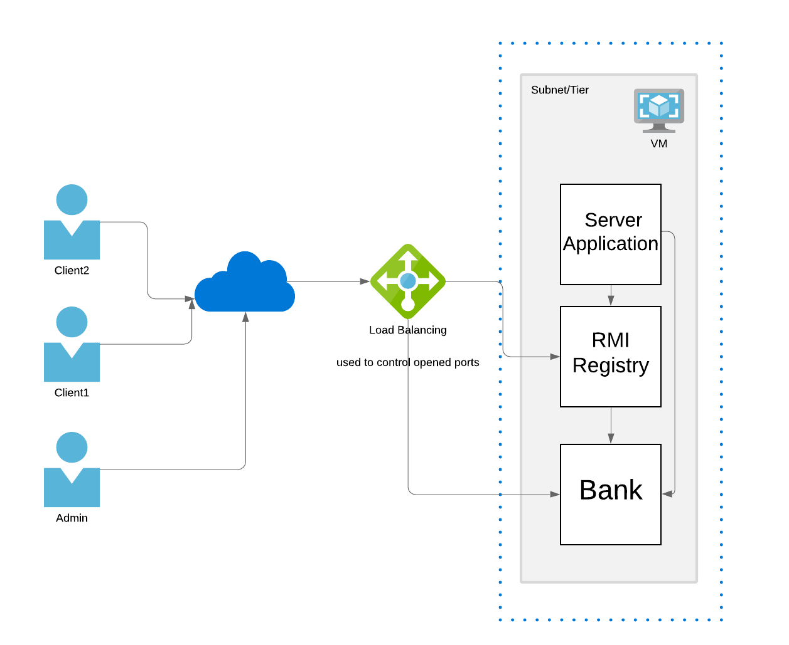
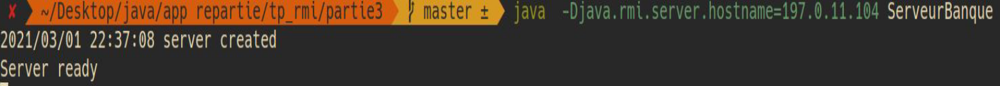

# Distributed Bank Application

## Presentation

This project is an implementation of a distributed bank application.
Multiple clients can connect to the app in the same time.
Each client can view their account, add money and also transfer it to other
clients. Only an admin can create an account in the bank system and he can
do so using a password "admin".  

This project uses java rmi to implement the distributed bank system by sharing
a bank object capable of executing function defined in its interface.  

here's an example of transfering money from client2(black) to client1(white):  
|   |   |
|---|---|
client2 creates his account             |   client2 add money to his account
  |   
client1 checks his account             |   client2 sends money to client1
  |   

finally client1 checks the money in his account

  

**Architecture:**  


I have deployed the server on azure VM and then i was able to connect to it using client code.


---
## Setup

**Execution On The Internet**:  
i have used ports 1099 and 1900 for the server and rmi-registry thus we have
to open these ports to in firewall and in the NAT of the router (and other security layers depending on your system).


(the one you find in https://www.whatismyip.com) and finally start the server with the option
`-Djava.rmi.server.hostname=YOUR_IP_ADDRESS`



then in the client code we should replace localhost by the registry's public ip address

```bash
javac *.java 
java -Djava.rmi.server.hostname=YOUR_IP_ADDRESS ServeurBanque
# in another terminal
java Client
```


 
